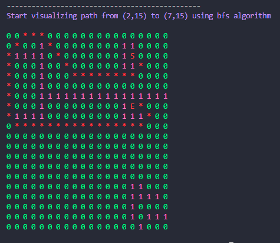
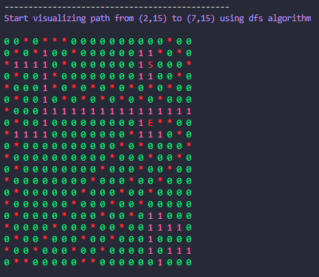
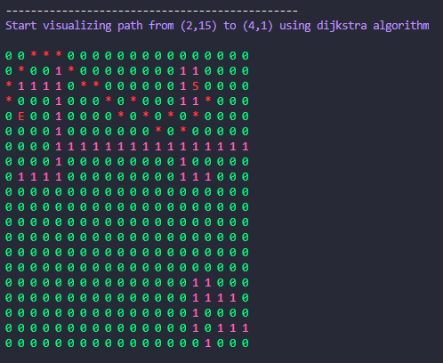
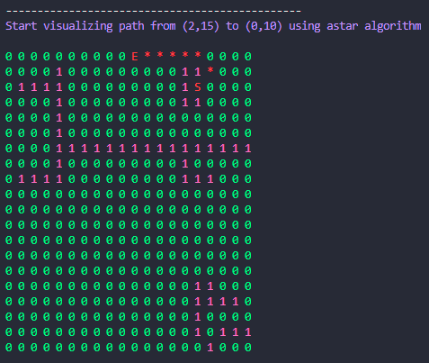

# path-search-algorithms-python
Different path search algorithms (BFS, DFS, Dijkstra, A*) on a 20x20 squared grid in Python

# Note
- Still not optimized because i didn't handle the case when there are too much walls at ending point
- For a larger grid, Dijkstra and A* seem taking much more time than BFS and DFS

# Install

```
pip install -r requirement.txt
```

# Run

```
python visualize.py
```

# Resources
- BFS: https://en.wikipedia.org/wiki/Breadth-first_search#Pseudocode
- DFS: https://en.wikipedia.org/wiki/Depth-first_search#Pseudocode
- Dijkstra: https://en.wikipedia.org/wiki/Dijkstra%27s_algorithm#Algorithm
- A*: https://en.wikipedia.org/wiki/A*_search_algorithm

# Result





